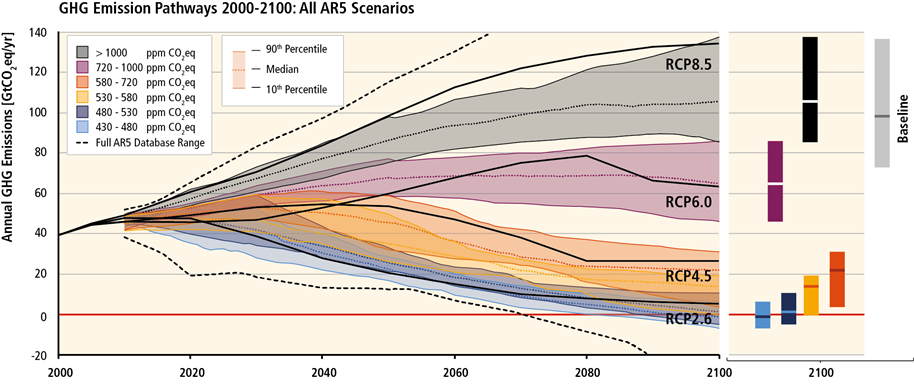

# Example seaborn plots with interquartile ranges

By default, seaborn only shows confidence intervals in lineplots, but can't shade interquartile ranges.

I used this workaround to manually shade between 5% and 95% https://stackoverflow.com/questions/61888674/can-you-plot-interquartile-range-as-the-error-band-on-a-seaborn-lineplot

This is sort of what I want it to look like in the end:

